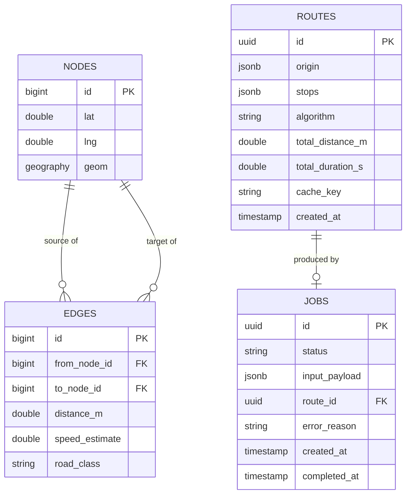

# Software Requirements Specification (SRS)
## Route Optimizer System

| | |
|---|---|
| **Version** | 1.0 |
| **Status** | Draft |
| **Author** | [Your Name] |
| **Date** | [Insert Date] |
| **Related Docs** | PRD.md (Product Requirements Document) |
| **Standard Reference** | Structured per IEEE 830 conventions |

---

## 1. Introduction

### 1.1 Purpose
This document specifies the functional and non-functional software requirements for the Route Optimizer system: an Express/Node.js backend and Angular frontend that compute point-to-point shortest paths and optimize multi-stop visiting order on a real road network. It is intended for the developer (as an implementation reference) and for technical reviewers assessing the system's design.

### 1.2 Scope
The software covers: road-network graph construction and storage, shortest-path computation (Dijkstra, A*), multi-stop route optimization (nearest-neighbor + 2-opt), a caching layer, asynchronous job processing, a REST/WebSocket API, and a single-page web client. It does not cover fleet management, live traffic ingestion, or native mobile clients (see PRD Section 5.2).

### 1.3 Definitions, Acronyms, Abbreviations

| Term | Definition |
|---|---|
| **TSP** | Traveling Salesman Problem — finding the shortest possible route visiting a set of points exactly once. |
| **VRP** | Vehicle Routing Problem — TSP generalization with multiple vehicles and/or constraints. |
| **2-opt** | Local search heuristic that removes two edges from a tour and reconnects it in the other possible way if it shortens the tour. |
| **A\*** | Best-first graph search algorithm using a heuristic to guide search toward the goal. |
| **PostGIS** | Spatial database extension for PostgreSQL. |
| **OSM** | OpenStreetMap — open, crowd-sourced map data. |
| **FR** | Functional Requirement. |
| **NFR** | Non-Functional Requirement. |

### 1.4 References
- OpenStreetMap / Overpass API documentation
- PostGIS documentation
- BullMQ documentation (Redis-backed job queues)
- Cormen, Leiserson, Rivest, Stein — *Introduction to Algorithms* (Dijkstra, graph search)

### 1.5 Overview
Section 2 describes the product at a high level. Section 3 details functional requirements per feature. Section 4 covers external interfaces. Section 5 summarizes the architecture. Section 6 defines the data model. Section 7 specifies non-functional requirements. Section 8 defines the API contract. Section 9 covers algorithm-specific requirements. Sections 10–12 cover testing, deployment, and appendices.

---

## 2. Overall Description

### 2.1 Product Perspective
Route Optimizer is a standalone, self-contained client-server web application. It is not a plug-in to an existing system. The client (Angular SPA) communicates with the server (Express REST API + WebSocket) over HTTPS. The server reads/writes a PostgreSQL+PostGIS database and uses Redis for caching and job queuing. See Section 5 for the architecture diagram.

### 2.2 Product Functions (Summary)
- Compute shortest path between two geographic points.
- Optimize visiting order for a set of stops.
- Cache and reuse prior route computations.
- Process large optimization requests asynchronously.
- Visualize routes and comparisons on an interactive map.

### 2.3 User Classes and Characteristics
- **End users** (dispatchers/drivers): non-technical, interact only through the Angular UI. No training assumed beyond basic map interaction (click, drag).
- **Developer/maintainer**: technical user interacting via API directly, CLI tooling, and admin/debug endpoints if present.

### 2.4 Operating Environment
- **Server**: Node.js (LTS version), Express 4.x, runs on Linux (containerized via Docker).
- **Client**: Angular (latest stable major version), evergreen browsers (Chrome, Firefox, Edge, Safari — last 2 versions).
- **Database**: PostgreSQL 15+ with PostGIS 3.x extension.
- **Cache/Queue**: Redis 7.x.
- **Deployment**: Docker Compose for local/demo; container-per-service architecture allows future migration to a managed container platform.

### 2.5 Design and Implementation Constraints
- Backend must be implemented in Express/Node.js; frontend must be implemented in Angular (project constraint per resume goals).
- Core pathfinding and optimization algorithms must be custom implementations, not delegated to a third-party directions API.
- Must run entirely on open-source/free-tier infrastructure — no dependency on a paid mapping API for core functionality.
- Road network scope limited to one pre-selected metro area for v1.

### 2.6 Assumptions and Dependencies
- OSM data for the chosen metro area is available and of sufficient quality (connected graph, minimal missing road segments).
- Redis and PostgreSQL are available as separate services (via Docker Compose in dev, managed services in any future deployment).
- Users have a modern browser with JavaScript and geolocation-adjacent map libraries enabled (geolocation itself is optional, not required).

---

## 3. System Features (Detailed Functional Requirements)

### 3.1 Feature: Point-to-Point Routing
**Description**: Compute the shortest path between two coordinates on the road graph.
**Priority**: P0

| ID | Requirement |
|---|---|
| FR-1.1 | The system shall accept an origin and destination as latitude/longitude pairs. |
| FR-1.2 | The system shall compute the shortest path using a custom Dijkstra implementation. |
| FR-1.3 | The system shall compute the shortest path using a custom A* implementation with an admissible heuristic (haversine distance to goal). |
| FR-1.4 | The system shall return total distance (meters), estimated travel time (seconds), and an ordered list of path coordinates for map rendering. |
| FR-1.5 | The system shall reject requests where origin or destination cannot be matched to a graph node within a configurable snap radius (e.g. 250 m), returning a 422 error. |

### 3.2 Feature: Multi-Stop Route Optimization
**Description**: Given an origin and a set of stops, determine a low-cost visiting order and full route.
**Priority**: P0

| ID | Requirement |
|---|---|
| FR-2.1 | The system shall accept an origin and a list of 2–25 stop coordinates. |
| FR-2.2 | The system shall generate an initial tour using a nearest-neighbor construction heuristic. |
| FR-2.3 | The system shall improve the initial tour using 2-opt local search until no improving swap is found or an iteration/time cap is reached. |
| FR-2.4 | The system shall return the optimized stop order, total distance, total estimated time, and the per-leg path geometry. |
| FR-2.5 | The system shall also return the naive (input-order) route's distance/time for comparison. |
| FR-2.6 | Requests exceeding 25 stops shall be rejected with a 400 error indicating the current limit (extensible in future versions). |

### 3.3 Feature: Asynchronous Job Processing
**Description**: Offload optimization requests likely to exceed a synchronous response budget.
**Priority**: P0

| ID | Requirement |
|---|---|
| FR-3.1 | Optimization requests with more than 15 stops shall be processed as background jobs rather than blocking the HTTP response. |
| FR-3.2 | The system shall return a job ID immediately upon job submission (HTTP 202 Accepted). |
| FR-3.3 | The system shall expose a job status endpoint returning one of: `queued`, `processing`, `completed`, `failed`. |
| FR-3.4 | The system shall support job status delivery via WebSocket push in addition to polling. |
| FR-3.5 | Failed jobs shall include an error reason retrievable via the status endpoint. |

### 3.4 Feature: Response Caching
**Description**: Avoid redundant computation for repeated or recent requests.
**Priority**: P0

| ID | Requirement |
|---|---|
| FR-4.1 | The system shall cache route results keyed by a deterministic hash of (origin, destination/stops, algorithm parameters). |
| FR-4.2 | Cached entries shall expire after a configurable TTL (default 24 hours). |
| FR-4.3 | Cache hits shall bypass algorithm computation entirely and return the stored result. |
| FR-4.4 | The system shall expose whether a given response was served from cache (for UI/debug transparency). |

### 3.5 Feature: Interactive Map UI
**Description**: Angular client for building, visualizing, and comparing routes.
**Priority**: P0 (core), P1 (comparison/reorder features)

| ID | Requirement |
|---|---|
| FR-5.1 | Users shall be able to add stops by clicking on the map or entering an address/coordinate. |
| FR-5.2 | The system shall render the computed route as a polyline on the map with distance/time summary displayed. |
| FR-5.3 | Users shall be able to remove or reorder stops before submitting for optimization. |
| FR-5.4 | (P1) The UI shall display the naive-order route and optimized route side by side or toggleable, with the distance/time delta highlighted. |
| FR-5.5 | (P1) Users shall be able to manually drag-and-drop reorder the optimized stop list and see the route update. |
| FR-5.6 | (P1) Users shall be able to toggle between Dijkstra and A* for point-to-point queries and view a latency/nodes-explored comparison. |

---

## 4. External Interface Requirements

### 4.1 User Interfaces
- Angular SPA with three primary views: **Route Builder** (map + stop input), **Results** (route summary, comparison), **Job Status** (progress for async optimizations).
- Responsive layout supporting desktop and tablet widths at minimum; mobile-responsive is a stretch goal.

### 4.2 Hardware Interfaces
- None beyond a standard client device with a modern browser and network connectivity. No specialized hardware required.

### 4.3 Software Interfaces
- **PostgreSQL + PostGIS**: persistent storage for the road graph (nodes/edges), computed routes, and job records.
- **Redis**: cache store and BullMQ job queue backend.
- **Mapping library**: Leaflet.js (or Mapbox GL JS) for client-side map rendering.
- **OSM data source**: Overpass API or a downloaded `.osm.pbf` extract, used at data-ingestion time only (build-time/offline process, not a runtime request path).

### 4.4 Communication Interfaces
- REST API over HTTPS, JSON request/response bodies.
- WebSocket channel for job status push updates.
- CORS restricted to the deployed frontend origin.

---

## 5. System Architecture Overview

The system follows a layered client-server architecture:

```
Angular client
      |
      v
Express API  (auth/validation/rate limiting)
      |
      +---------------------+
      v                     v
Algorithm engine       Redis (cache + BullMQ queue)
(Dijkstra, A*, 2-opt)
      |
      v
PostgreSQL + PostGIS (road graph, routes, jobs)
```

Large or slow optimization requests are handed to a BullMQ worker process (separate from the API process) that reads jobs from Redis, computes the result, writes it to PostgreSQL, and updates job status — decoupling heavy computation from the request/response cycle. See PRD.md and the accompanying architecture diagram for the full component breakdown.

---

## 6. Data Requirements

### 6.1 Entity-Relationship Overview



### 6.2 Data Dictionary (Key Fields)

| Table | Field | Notes |
|---|---|---|
| `nodes` | `geom` | PostGIS `GEOGRAPHY(Point, 4326)`, GiST-indexed for nearest-node lookup. |
| `edges` | `distance_m` | Precomputed edge weight used directly by Dijkstra/A*, avoiding runtime geometry calculation. |
| `routes` | `cache_key` | Deterministic hash of normalized request parameters; unique-indexed. |
| `jobs` | `status` | Enum: `queued`, `processing`, `completed`, `failed`. |

---

## 7. Non-Functional Requirements

| ID | Category | Requirement |
|---|---|---|
| NFR-1 | Performance | Point-to-point routing shall respond in < 300 ms (p95) on cache miss, < 50 ms on cache hit, for graphs up to ~50k nodes. |
| NFR-2 | Performance | Synchronous multi-stop optimization (≤15 stops) shall complete in < 2 s (p95). |
| NFR-3 | Scalability | The API layer shall be stateless so that additional instances can be run behind a load balancer without code changes. |
| NFR-4 | Reliability | Failed background jobs shall be retried up to 2 times with exponential backoff before being marked `failed`. |
| NFR-5 | Security | All input payloads shall be validated (e.g. via Zod/Joi schemas) and rejected with a 400 error on malformed input. |
| NFR-6 | Security | The API shall apply rate limiting per client IP (e.g. 100 requests/minute) to prevent abuse. |
| NFR-7 | Security | Database access shall use parameterized queries exclusively; no raw string-concatenated SQL. |
| NFR-8 | Usability | The map UI shall provide visible loading/progress states for any operation exceeding 300 ms. |
| NFR-9 | Maintainability | Algorithm modules (pathfinding, optimization) shall maintain ≥ 80% unit test coverage. |
| NFR-10 | Maintainability | Code shall be linted (ESLint) and formatted (Prettier) with checks enforced in CI. |
| NFR-11 | Portability | The full stack (API, worker, Postgres, Redis, frontend) shall run via a single `docker compose up` command. |
| NFR-12 | Observability | The API shall log structured request/response and job lifecycle events at minimum (info/error levels). |

---

## 8. API Specification (Representative Endpoints)

### 8.1 `POST /api/routes/point-to-point`
**Request**
```json
{
  "origin": { "lat": 12.9716, "lng": 77.5946 },
  "destination": { "lat": 12.9352, "lng": 77.6146 },
  "algorithm": "astar"
}
```
**Response — 200**
```json
{
  "distance_m": 8420,
  "duration_s": 960,
  "path": [[12.9716, 77.5946], "..."],
  "algorithm": "astar",
  "cached": false
}
```

### 8.2 `POST /api/routes/optimize`
**Request**
```json
{
  "origin": { "lat": 12.9716, "lng": 77.5946 },
  "stops": [
    { "lat": 12.9611, "lng": 77.6387 },
    { "lat": 12.9352, "lng": 77.6146 }
  ]
}
```
**Response — 200 (≤15 stops, synchronous)**
```json
{
  "optimized_order": [1, 0],
  "total_distance_m": 15230,
  "total_duration_s": 1740,
  "naive_distance_m": 18900,
  "improvement_pct": 19.4
}
```
**Response — 202 (>15 stops, async)**
```json
{ "job_id": "b3f1c9...", "status": "queued" }
```

### 8.3 `GET /api/jobs/{job_id}`
**Response — 200**
```json
{ "job_id": "b3f1c9...", "status": "completed", "route_id": "a12e..." }
```

### 8.4 Error Response Shape (all endpoints)
```json
{ "error": { "code": "VALIDATION_ERROR", "message": "stops must contain 2-25 items" } }
```

---

## 9. Algorithm Requirements

### 9.1 Shortest Path (Dijkstra / A*)
- Graph represented as an adjacency list; priority queue implemented with a binary heap (target complexity: O((V + E) log V)).
- A* heuristic: haversine distance from current node to destination — must be admissible (never overestimate true cost) to guarantee optimality.
- Both algorithms shall be benchmarked against each other on identical queries; nodes-explored and wall-clock time shall be logged for comparison (supports FR-5.6).

### 9.2 Multi-Stop Optimization (TSP Heuristic)
- **Construction phase**: nearest-neighbor heuristic, O(n²) for n stops.
- **Improvement phase**: 2-opt local search, bounded to a maximum iteration count or wall-clock budget (e.g. 500 ms) to guarantee responsiveness.
- Correctness validation: for n ≤ 10, compare heuristic output against brute-force optimal tour to quantify the approximation gap (documented in README/benchmarks, not a runtime requirement).

### 9.3 Complexity Documentation
- Each algorithm module's Big-O time/space complexity shall be documented in code comments and referenced in the project README.

---

## 10. Testing Requirements

| Test Type | Coverage Target |
|---|---|
| Unit tests — algorithm modules (Dijkstra, A*, 2-opt) | ≥ 80%, including edge cases (disconnected graph, single stop, duplicate coordinates) |
| Integration tests — API endpoints | All P0 endpoints, including validation-error paths |
| Load testing | Point-to-point endpoint under concurrent load (e.g. via k6 or autocannon) to validate NFR-1 |

---

## 11. Deployment Requirements

- **Docker Compose services**: `api`, `worker`, `frontend`, `postgres` (with PostGIS), `redis`.
- **CI pipeline** (GitHub Actions): lint → unit tests → integration tests → build, on every push/PR.
- **Environment configuration** via `.env` files; no secrets committed to version control.

---

## 12. Appendices

### 12.1 Traceability Matrix (PRD → SRS)

| PRD Feature | SRS Requirement(s) |
|---|---|
| F1 Point-to-point routing | FR-1.1–1.5 |
| F2 Multi-stop optimization | FR-2.1–2.6 |
| F3 Self-implemented pathfinding | FR-1.2, FR-1.3, Section 9.1 |
| F4 TSP heuristic | FR-2.2, FR-2.3, Section 9.2 |
| F5 Async job processing | FR-3.1–3.5 |
| F6 Response caching | FR-4.1–4.4 |
| F7 Interactive map UI | FR-5.1–5.3 |
| F8 Naive vs. optimized comparison | FR-5.4 |
| F9 Manual reordering | FR-5.5 |
| F10 Algorithm toggle | FR-5.6 |

### 12.2 Open Items for Future Versions
- Capacity/time-window constraints (VRPTW) — see PRD Section 5.3.
- Multi-vehicle assignment.
- Live traffic ingestion and dynamic re-routing.
